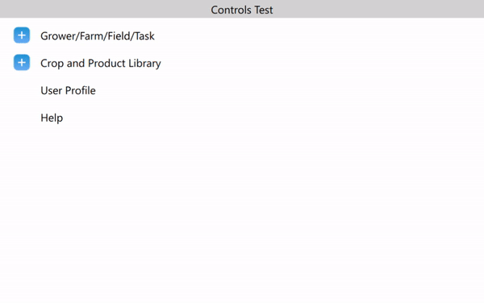

# TreeView Model-View Example - CNH 

This project demonstrates a simple TreeView implementation using the Model-View architecture in Qt 6.4. The project consists of a custom C++ model that inherits from `QAbstractItemModel` to provide the data, and a QML-based TreeView for displaying the hierarchical data.

## Requirements

To build and run this project, you need:

- Qt 6.4 or later installed on your system
- CMake 3.16 or later
- Qt Creator (optional but recommended for ease of development)

## Project Structure

The project is organized into the following directories:

- `inc` and `src`: Contains the C++ model class (`Model`) that provides the data for the TreeView, alongside the Tree data structure (`TreeItem`) and the object that each element in the tree stores (`TreeItemData`)
- `views`: Contains the QML file for the main view (TreeView and the main application window).
- `assets`: Contains any icons used in the project. All of them were obtained from FlatIcon.
- `src/main.cpp`: The entry point of the application that sets up the Qt environment and starts the Qt Quick application.
- `database.txt`: Contains the data used to populate the TreeView.

## Building the Project

Follow these steps to build the project:

1. Open Qt Creator and open the CMake project by selecting the `CMakeLists.txt` file in the root directory.
2. Configure the project and set the build directory (e.g., `build`).
3. Build the project using the Qt Creator interface or by running the cmake build command manually.

## Considerations

1. All data used to populate the Tree View is inside the `database.txt` file, and is formatted as `type: Description`, where `type` is used to link that entry with an icon, and `Description` is the text that is shown on screen.
2. The `TreeItemData` class contains a Hash Map that maps `type` to `icon` for simplicity. In a production environment, it would be ideal to have a column containing the icon url alongside that object.
3. Besides that, `database.txt` also contains the indentation that represents the parent-children relationship of the Tree.
4. That file is read and parsed inside the `Model`, specifically on the `Model::setupData` function.
5. At the end of the tree shown on the reference video, there are two buttons, `User Profile` and `Help`, that I assumed behaved differently than the rest of tree, so I create them separatelly after populating the tree with database contents. They are clickable and should have a signal/slot connection to handle click events.
6. The `TreeView` was developed using the default TreeView QML element.

## Example

Here's the view in action (`docs/example.gif`):

  

